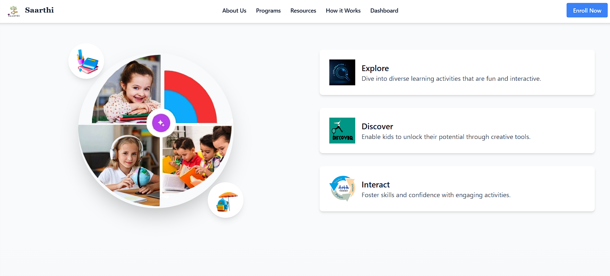
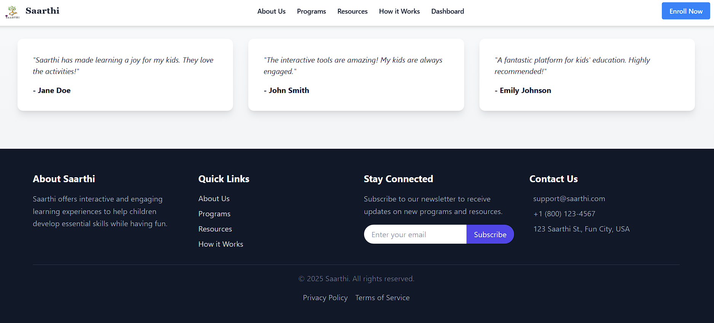
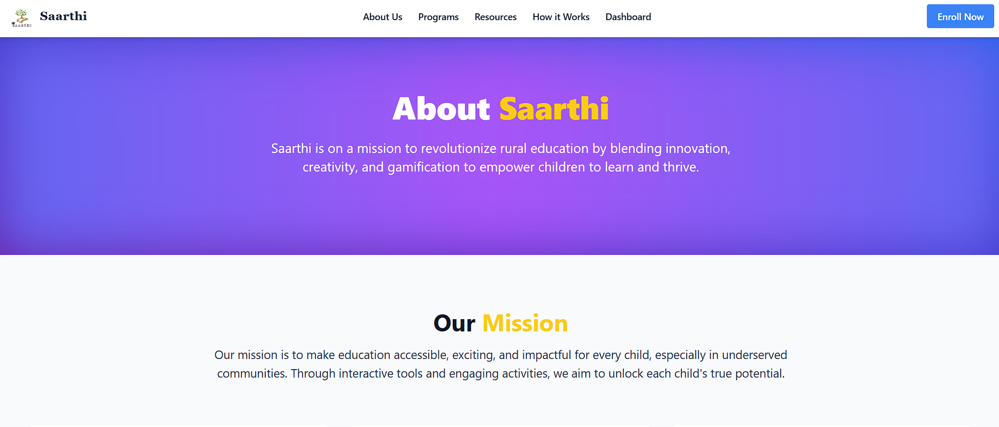

Saarthi 
Website Link : https://saarthiedu.netlify.app/

Clone and Setup the Project
Step 1: Clone the Repository
Clone the project from the GitHub repository:

bash : git clone https://github.com/ayuxsh009/saarthi.git
Step 2: Navigate to the Project Directory

cd saarthi

Step 3: Install Dependencies
Using npm:

npm install or npm i
Using yarn:

Step 4: Start the Development Server
To run the app in development mode:

Using npm:

npm run dev

Visit http://localhost:5173 in your browser to view the app.